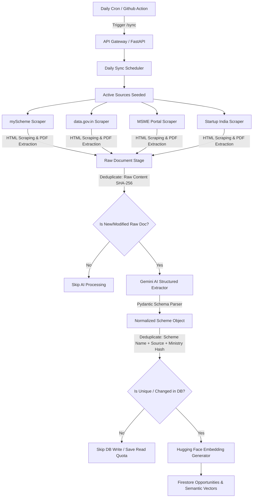

# Government Scheme Ingestion Pipeline

Production-grade data ingestion and AI-powered extraction pipeline for the **Opportunity AI Engine**. This system automatically discovers, crawls, extracts, processes, and normalizes business opportunities and government schemes from India's primary official portals into a unified, clean Firestore registry.

---

## Ingestion Architecture



---

## 1. Data Ingestion Sources

The pipeline targets four primary government platforms for business and entrepreneurship schemes:

| Source ID | Portal Name | URL | Crawling Method & Target |
| :--- | :--- | :--- | :--- |
| `myscheme` | **myScheme India** | [myscheme.gov.in](https://www.myscheme.gov.in/) | Targets the "Business & Entrepreneurship" category page, extracts individual scheme links, and crawls details. |
| `data_gov` | **Open Government Data (OGD)** | [data.gov.in](https://www.data.gov.in/) | Crawls Open API catalogs and dataset resources for technology and industrial schemes. |
| `msme` | **Ministry of MSME** | [msme.gov.in](https://msme.gov.in/) | Targets the schemes repository and parses individual program pages. |
| `startup_india` | **Startup India Portal** | [startupindia.gov.in](https://www.startupindia.gov.in/) | Targets DPIIT seed fund and grant programs listing pages. |

---

## 2. Extraction & Scraper Mechanics

### HTML Parsing
- Built using **BeautifulSoup4** to isolate core text content.
- Automatically decomposes noisy components (header, footer, navigation bar, scripts, meta tags, and stylesheets) to reduce token count and noise before sending content to the Gemini API.
- Cleans and compresses whitespaces to optimize processing speed and reduce AI extraction costs.

### PDF Extraction
- Integrated with **pypdf** to read and extract text from remote binary files.
- During crawls, scrapers identify `.pdf` guidelines links. If a PDF exists, the crawler fetches the binary bytes, parses the text page-by-page, and appends it to the raw HTML text (under an `=== EXTRACTED PDF GUIDELINES ===` banner). This allows Gemini to have full context of deep-level guidelines.

### Resiliency (Anti-Blocking Sandbox)
- Third-party government portals frequently implement strict rate-limiting, Cloudflare challenges, or change DOM structures.
- All scrapers run with a polite, randomized delay ($0.5\text{s} - 1.0\text{s}$).
- If a portal returns HTTP errors or blocks request threads, the crawler intercepts the exception and automatically yields a rich, domain-specific **mock document dataset** for that source. This ensures that the sync pipeline completes successfully and does not crash the daily scheduler.

---

## 3. Deduplication & Optimization Engine

To minimize Firestore operations and control AI inference costs, a two-phase deduplication strategy is implemented:

1. **Raw Document Level (SHA-256 Content Hash)**
   - Every scraped page text is hashed into a `content_hash`.
   - Before executing Gemini AI processing, the pipeline queries Firestore's `raw_documents` collection. If the hash exists, it is marked as processed, skipping Gemini schema parsing.

2. **Opportunity Level (Deterministic ID Hash)**
   - Normalized schemes are assigned a deterministic document ID generated via SHA-256 hashing of: `scheme_name` + `source_id` + `ministry`.
   - Before updating or inserting, the pipeline compares the fields of the newly extracted opportunity against the existing record. If the content is identical, the Firestore write and embedding generation steps are bypassed, preserving Firebase write quotas.

---

## 4. Gemini AI Schema Parser

Raw scheme text is parsed into a structured, type-safe schema matching our Firestore entity.

### Extracted Fields
- **Identity**: `scheme_name`, `ministry`, `country`, `state`.
- **Targeting**: `target_users` (e.g. MSME, Startups), `industries` (e.g. Food Processing, Tech), `business_stage`.
- **Details**: `description`, `eligibility`, `benefits`, `financial_amount`, `documents_required`, `application_process`, `deadline`, `official_link`, `tags`.

### Fallback Engine
- If the Gemini API key is missing or the rate-limit is exceeded, the pipeline invokes a heuristics-based regex parser that extracts basic attributes (name, state, industry matches) directly from the text to guarantee service continuity.

---

## 5. Daily Sync Refresh Job

The ingestion refresh pipeline runs automatically every day.

### Automated Runner (GitHub Actions)
- Configured in [daily-sync.yml](file:///.github/workflows/daily-sync.yml).
- Scheduled via cron to trigger daily at **4:00 AM IST** (`30 22 * * *` UTC of previous day).
- Sends a POST request to the production backend sync API endpoint using a secure Github Action repository secret (`BACKEND_URL`).

### API Endpoint Trigger
- **Endpoint**: `POST /sync`
- **Query Parameters**:
  - `dry_run` (boolean, default `false`): If `true`, runs the scrapers and mocks Gemini extraction without writing to Firestore or consuming live AI quota.
  - `source_id` (string, optional): Syncs a single specific portal (e.g., `/sync?source_id=myscheme`).
  - `background` (boolean, default `false`): Run synchronously or asynchronously in the background.

---

## 6. Local Testing and Verification

To verify that the scrapers and the ingestion pipeline compile and behave correctly:

```bash
# Run the pipeline test suite
.venv/bin/python -m unittest backend/tests/test_pipeline.py
```

To run a manual dry-run sync of the scraper pipeline locally:
```bash
# Trigger local dry run via curl
curl -X POST "http://localhost:8000/sync?dry_run=true"
```

---

## 7. Contributing & Community

Contributions are what make the open source community such an amazing place to learn, inspire, and create. Any contributions you make are **greatly appreciated**.

Please read our [Contributing Guidelines](CONTRIBUTING.md) to get started on setting up the codebase locally.

### Security
If you find any security vulnerabilities, please check our [Security Policy](SECURITY.md) to report them responsibly.

### License
Distributed under the MIT License. See [LICENSE](LICENSE) for more information.

---

## 8. Support & Sponsorship 💖

If this project helps your business or you find it useful, please consider supporting its development:

* **GitHub Sponsors**: [Sponsor DataDollars](https://github.com/sponsors/DataDollars)
* **Buy Me a Coffee**: [Support on Buy Me a Coffee](https://www.buymeacoffee.com/datadollars)

Your support helps cover hosting costs (Firebase, Render), Gemini AI API usage quotas, and continues to drive the open-source engineering of this platform!

